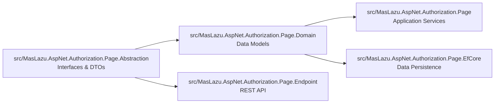

# MasLazu.AspNet.Authorization.Page

A comprehensive ASP.NET Core library for implementing page-based authorization systems. This solution provides a complete architecture for managing pages, page groups, and their associated permissions with full CRUD operations, validation, and API endpoints.

## Architecture

This solution follows Hexagonal Architecture (Ports and Adapters) principles, where the core domain and abstraction layers define the ports (interfaces), and the outer layers provide adapters (implementations) for different concerns.



## Projects

### MasLazu.AspNet.Authorization.Page.Abstraction

**Purpose**: Defines contracts and data models for the authorization system.

- Service interfaces (`IPageService`, `IPageGroupService`, `IPagePermissionService`)
- Data Transfer Objects (DTOs) for entities
- Request models for create/update operations
- Base abstractions that other layers implement

### MasLazu.AspNet.Authorization.Page.Domain

**Purpose**: Contains the core business entities and domain logic.

- Domain entities: `Page`, `PageGroup`, `PagePermission`
- Entity relationships and navigation properties
- Domain constraints and business rules

### MasLazu.AspNet.Authorization.Page

**Purpose**: Implements application services and business logic.

- Concrete service implementations inheriting from `CrudService`
- FluentValidation validators for request models
- Property mapping utilities for sorting/filtering
- Dependency injection extensions

### MasLazu.AspNet.Authorization.Page.EfCore

**Purpose**: Provides Entity Framework Core data persistence.

- Database context (`AuthorizationPageDbContext`)
- Entity type configurations with relationships and indexes
- Database schema definitions
- EF Core integration setup

### MasLazu.AspNet.Authorization.Page.Endpoint

**Purpose**: Exposes REST API endpoints using FastEndpoints.

- Organized endpoint groups for API versioning
- CRUD endpoints for all entities
- Pagination and filtering support
- OpenAPI/Swagger documentation

## Core Features

### Page Management

- Hierarchical page structure (parent-child relationships)
- Page grouping for organization
- Unique code and path identification
- Full CRUD operations with validation

### Permission System

- Page-permission associations
- Flexible permission linking
- Unique constraints on page-permission combinations

### API Endpoints

- RESTful API design
- Pagination support
- Sorting and filtering capabilities
- Comprehensive error handling

### Data Persistence

- Entity Framework Core integration
- Optimized database schema with indexes
- Relationship management with cascade options
- Migration-ready configurations

## Dependencies

- **.NET 9.0**: Target framework for all projects
- **MasLazu.AspNet.Framework.Application**: Base application services and utilities
- **MasLazu.AspNet.Framework.Domain**: Base domain entities
- **MasLazu.AspNet.Framework.EfCore**: EF Core base context and configurations
- **MasLazu.AspNet.Framework.Endpoint**: FastEndpoints base classes and utilities

## Getting Started

### Prerequisites

- .NET 9.0 SDK
- SQL Server (or compatible EF Core provider)

### Installation

1. Clone the repository:

```bash
git clone https://github.com/MasLazu/MasLazu.AspNet.Authorization.Page.git
cd MasLazu.AspNet.Authorization.Page
```

2. Restore dependencies:

```bash
dotnet restore
```

3. Build the solution:

```bash
dotnet build
```

### Usage in Your Application

1. Add the necessary NuGet packages or project references
2. Configure services in `Program.cs`:

```csharp
builder.Services.AddAuthorizationPageApplication();
builder.Services.AddAuthorizationPageEntityFrameworkCore();
builder.Services.AddAuthorizationPageEndpoints();
```

3. Configure the database context:

```csharp
builder.Services.AddDbContext<AuthorizationPageDbContext>(options =>
    options.UseSqlServer(connectionString));
```

4. Run database migrations (if using EF Core migrations)

5. The API endpoints will be available under `/api/v1/` routes

## API Documentation

Once integrated, API documentation is available via Swagger/OpenAPI at the configured endpoint (typically `/swagger`).

### Available Endpoints

- `GET /api/v1/pages/{id}` - Get page by ID
- `POST /api/v1/pages/paginated` - Get paginated pages
- `GET /api/v1/page-groups/{id}` - Get page group by ID
- `POST /api/v1/page-groups/paginated` - Get paginated page groups
- `GET /api/v1/page-permissions/{id}` - Get page permission by ID
- `POST /api/v1/page-permissions/paginated` - Get paginated page permissions

## Database Schema

The solution creates the following database tables:

- **PageGroups**: Hierarchical organization of pages
- **Pages**: Individual pages with parent-child relationships
- **PagePermissions**: Many-to-many relationship between pages and permissions

See the EfCore project README for detailed schema information.

## Contributing

1. Follow the established architecture patterns
2. Maintain separation of concerns across layers
3. Add appropriate tests for new functionality
4. Update documentation as needed

## License

This project is licensed under the MIT License - see the LICENSE file for details.
